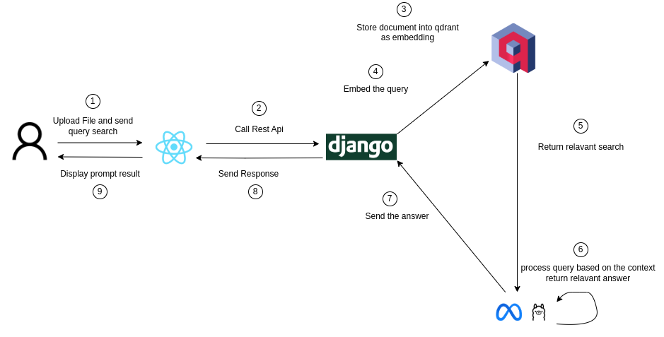

# 🚀 RAG Chat Full-Stack Application

## 📖 Overview

This project integrates **React (Frontend)**, **Django (Backend API)**, **Qdrant (Vector Database)**, and **LLMs (Large Language Models)** to build an RAG Chat system.

### 🛠️ **Tech Stack**

- **Frontend:** React, Tailwind CSS, Context Api,
- **Backend:** Django REST Framework (DRF)
- **Database:** PostgreSQL & Qdrant (Vector Search)
- **AI:** OpenAI API / Llama / Mistral (LLM)

---

## 🔄 **How It Works**

1. 🖥 **User inputs a query** in the React frontend
2. 🔗 The request is sent to the Django backend
3. 📡 Django queries **Qdrant** for relevant vector embeddings
4. 🧠 If needed, Django sends the query to an **LLM** for AI-generated responses
5. 🚀 The final response is sent back to the React app

---

## 📸 **Architecture Diagram**



---

## 🚀 **Getting Started**

### **1️⃣ Clone the Repository**

```sh
git clone https://github.com/your-username/your-repo.git
cd your-repo

```
